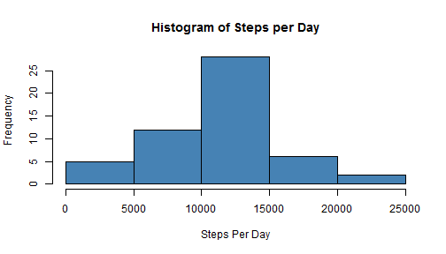
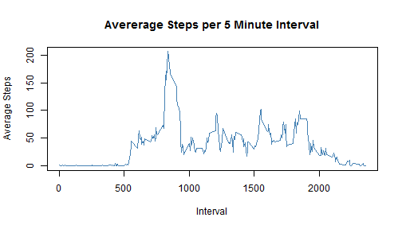
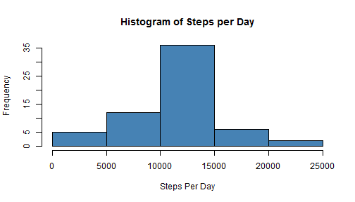
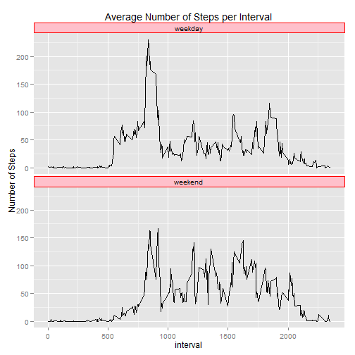

# Reproducible Research: Peer Assessment 1

```r
library(ggplot2)
```

```
## Warning: package 'ggplot2' was built under R version 3.0.3
```

```r
library(reshape)
```

```
## Warning: package 'reshape' was built under R version 3.0.3
```

```r
opts_chunk$set(echo = TRUE)
options(scipen = 1, digits = 2)
```


## Loading and preprocessing the data

```r
data <- read.csv("activity/activity.csv")
perday <- as.data.frame(tapply(data$steps, data$date, FUN = sum))
colnames(perday) <- c("totalsteps")
```


## What is mean total number of steps taken per day?

```r
hist(perday$totalsteps, col = "steelblue", main = "Histogram of Steps per Day", 
    xlab = "Steps Per Day")
```

 

```r

perday.mean <- mean(perday$totalsteps, na.rm = TRUE)
perday.median <- median(perday$totalsteps, na.rm = TRUE)
```

The mean total number of steps taken per day is 10766.19 and the median total number of steps taken per day is 10765

## What is the average daily activity pattern?

```r
perinterval <- as.data.frame(tapply(data$steps, data$interval, FUN = mean, na.rm = TRUE))
colnames(perinterval) <- c("averagesteps")
perinterval$interval = row.names(perinterval)
plot(perinterval$interval, perinterval$averagesteps, type = "l", col = "steelblue", 
    main = "Avererage Steps per 5 Minute Interval", xlab = "Interval", ylab = "Average Steps")
```

 

```r
max.perinterval <- perinterval[perinterval$averagesteps == max(perinterval$averagesteps), 
    ]
```

5-minute interval number 835, on average across all the days in the dataset, contains the maximum number of steps, 206.17 


## Imputing missing values
This section creates a new dataset that is equal to the original dataset but with the missing data filled in. The strategy used to fill in missings values is to set the NA values in the data set to the mean for that 5 minute interval across all days.


```r
missing.data <- !complete.cases(data)
nrows.missing <- nrow(data[missing.data, ])
```

The total number of rows containig NAs is 2304


```r
data.imputed <- data
data.imputed[is.na(data.imputed)] <- perinterval$averagesteps
perday.imputed <- as.data.frame(tapply(data.imputed$steps, data.imputed$date, 
    FUN = sum))
colnames(perday.imputed) <- c("totalsteps")
hist(perday.imputed$totalsteps, col = "steelblue", main = "Histogram of Steps per Day", 
    xlab = "Steps Per Day")
```

 

```r

perday.imputed.mean <- mean(perday.imputed$totalsteps, na.rm = TRUE)
perday.imputed.median <- median(perday.imputed$totalsteps, na.rm = TRUE)
```


After imputing, setting the NA values in the data set to the mean for that 5 minute interval, The mean total number of steps taken per day is 10766.19 and the median total number of steps taken per day is 10766.19

By imputing missing values in the data set, mean total number of steps taken each day changed by 0 and the per day and the median total number of steps taken each day changed by 1.19

## Are there differences in activity patterns between weekdays and weekends?

```r


data.imputed$weekend <- weekdays(as.Date(data.imputed$date)) == "Sunday" | weekdays(as.Date(data.imputed$date)) == 
    "Saturday"

data.imputed$weekend[data.imputed$weekend == TRUE] <- "weekend"
data.imputed$weekend[data.imputed$weekend == FALSE] <- "weekday"

a <- melt(data.imputed, id = c("interval", "weekend"), na.rm = TRUE)
a$value <- as.numeric(a$value)
```

```
## Warning: NAs introduced by coercion
```

```r
perinterval.weekend <- cast(a, interval + weekend ~ variable, mean)
perinterval.weekend$weekend <- as.factor(perinterval.weekend$weekend)


p <- ggplot(perinterval.weekend, aes(interval, steps))
p + geom_line() + facet_wrap(~weekend, ncol = 1, nrow = 2) + labs(y = "Number of Steps") + 
    labs(title = "Average Number of Steps per Interval") + theme(strip.background = element_rect(colour = "red", 
    fill = "pink"))
```

 

```r

```


